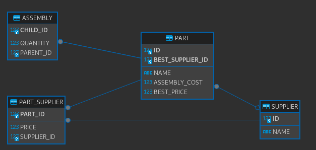

# parts

## Pre-requisites

- Git
- Node: v18.16.1
- Java 17

## Interview Rules

Welcome to this interview, you have 3 hours to do as much as you can.

You can use :

1. your favorite IDE
2. the Internet (stackoverflow, Github, online documentation, ...except AI)

You can not use:

1. AIs (ChatGPT, Copilot...)

## The project

This project represents a real life scenario, you can use common sense for parts that are not explicitly specified,
you can also ask your interviewer the same way you can ask your product owner or customer.

The goal of this project is to help a company deliver complex parts to their customers while reducing cost.

### Entities

All entities are defined in the [model folder](src/main/java/com/tailosoft/interview/parts/domain).

The most important ones can be seen in this schema:  


**You can add columns/fields to these tables/entities, but you can not remove any.**

#### Part

A part is manufactured item purchased and sold by the company, it can be as simple as a screw and as complex as a car.  
By assembling parts we can create more complex parts.

Each part can:

1. be purchased from one or more suppliers (or none)
2. be assembled (or not) from other smaller parts

#### Assembly

Assembly is a table that helps describe how a parent part can be assembled from child parts.
if this table contains:

| Parent | Child | quantity |
| ------ | ----- | -------- |
| A      | B     | 2        |
| A      | C     | 4        |

It means that to assemble Part A we need:

- 2 x B Parts
- 4 x C Parts

#### Supplier

A supplier is someone that can sell parts to our company

#### Part Supplier

Part Supplier is table that shows the price lists of all suppliers, a part can have 0, 1 or many suppliers,
with each supplier having different or similar prices.

### Reducing Cost

To reduce cost, the company can purchase complex parts directly from suppliers, or assemble them in house.

The `bestPrice` field of a part represents the best price at which a part can be acquired either by:

1. acquiring children parts at there best price and adding the assembly cost
2. purchasing the part directly for the cheapest supplier

whatever is cheapest.

The `bestSupplier` is null if it is cheaper to assemble the part.

## Dev stack

### Frontend: Angular

To start the frontend first install the dependencies

```bash
npm install
```

then start the frontend

```bash
npm start
```

### Backend: Java

to start the backend, use you IDE or:

```bash
./gradlew -x webapp
```

## Testing

To launch your application's tests, run:

```
./gradlew test integrationTest jacocoTestReport
```

### Client tests

Unit tests are run by [Jest][]. They're located in [src/test/javascript/](src/test/javascript/) and can be run with:

```
npm test
```

## Your Job

You are tasked with the following list.

Clone the project, and create a new branch `yyyymmdd-firstName-lastName`

create a separate commit for each task, and push them on the same branch.

1. List the advantages and disadvantages of storing best price and best supplier

2. Update the code to prevent users (even malicious ones) from changing the best price and best suppliers of `Part`.

3. Ensure that whatever happens, all parts have the correct best price and best supplier.  
   (ex: bestPrice and bestSupplier needs to be updated automatically if the supplier changes his prices)

4. Create a new endpoint `POST`: `/parts/recompute-all` that recomputes all best prices and best suppliers in an optimal fashion.  
   (in case you forgot a use case where bestPrice and bestSupplier should have been updated) then add a button on the frontend that triggers the recalculation.

5. Create a new endpoint `POST`: `/parts/optimize-cost` that receives a json: { partId: desiredQuantity }, ex:

   ```json
   {
     "1": 3,
     "2": 4
   }
   ```

   and returns a similar structure with parts to purchase:

   ```json
   {
     "1": 3,
     "3": 4,
     "4": 8
   }
   ```

   In this case for example, we want 3 parts with id "1" and 4 parts with "2".
   The result is that we need to:

   - buy parts with id "1" directly from supplier
   - assemble parts with id "2" by purchasing parts with ids "3" and "4".

   Add a page with a table with two columns:

   | Part | quantity |
   | ---- | -------- |
   | A    | 3        |
   | B    | 4        |
   | +    |          |

   When you click on "+" a dropdown appears that allows you add a new part, and the second column is editable and allows to request a specific quantity.

   Add a button below the table, that sends the requests and print the result in a new table.

6. Add tests to ensure that your endpoints work as expected.
